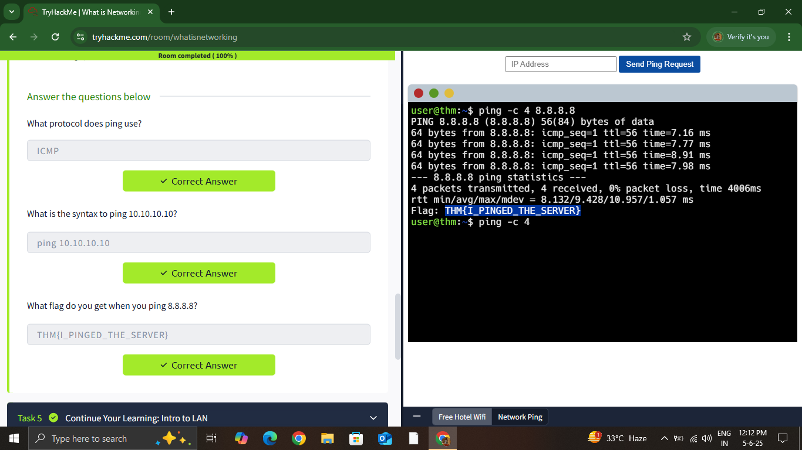

# 🛡️ TryHackMe – Introduction to Cyber Security

## 📘 Overview
This room introduces the fundamentals of cybersecurity, including offensive and defensive roles, basic networking, DNS, malware analysis, and Linux usage. It’s designed for absolute beginners and offers both theoretical and practical exercises — all browser-based.

---

## 🧪 What I Worked On

### 1️⃣ Offensive Security Introduction
- 🔍 Loved the quote: “To outsmart a hacker, you need to think like one.”
- ✅ Simulated an attack on a fake virtual bank using *Gobuster*
- 🎯 Learned the mindset of ethical hacking

---

### 2️⃣ Defensive Security Introduction
- 🛡️ Learned about user awareness, asset management, and documentation
- 🔁 Introduced to:
  - Security Operations Center (SOC)
  - Threat Intelligence
  - Digital Forensics & Incident Response (DFIR)
  - Malware Analysis (Static & Dynamic) — totally new to me!
- 🧪 Hands-on: Used a simulated SIEM tool to detect & block a suspicious IP
- 💡 My favorite part: actively experiencing the defensive side

---

### 3️⃣ Networking Basics
- 🌐 Learned history of the Internet, IP addressing (IPv4 vs IPv6), MAC addresses
- ⚠️ Practical: Performed a basic spoofing demo

---

### 4️⃣ DNS in Detail
- 🧠 Learned DNS hierarchy and record types: A, AAAA, CNAME, MX, TXT
- 🛠️ Practical: Queried DNS records and found:
  - CNAME
  - TXT
  - MX record with numerical priority

---

### 🐧 Linux Fundamentals
- Explored basic Linux commands and terminal navigation
- Got comfortable using CLI in cybersecurity contexts

---

## 📝 Key Takeaways
- Cybersecurity involves both attackers and defenders
- Practical experience builds confidence — not just theory
- Tools like Gobuster and SIEM systems are powerful
- I’m excited to dive deeper into real labs and CTFs

---
## 📸 Screenshot – Ping in Virtual Lab

